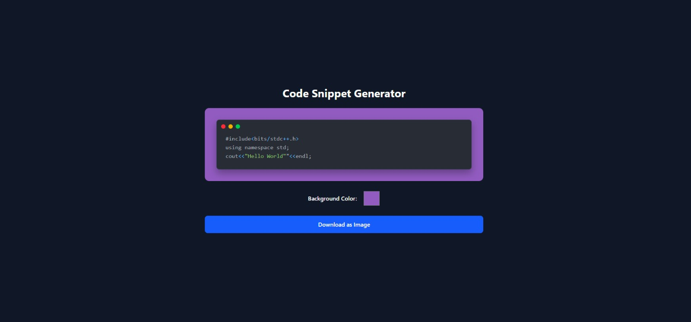

# DEvUtility

A beautiful, responsive web application to view and analyze your LeetCode statistics.


Check out the **[Live Demo] for Github readme here (https://meek-stroopwafel-2f662a.netlify.app/)** here!
## Features

- 📊 Fetch and display comprehensive LeetCode user statistics
- 📈 Beautiful visualizations of Code snippets
- 🎯 View skill proficiency across different problem categories
- 📱 Github Readme Generator
- 🚀 Fast, modern UI built with React and Tailwind CSS



## Technologies Used

- React.js
- Tailwind CSS
- Chart.js and react-chartjs-2 for data visualization
- React Icons for beautiful iconography
- Axios for API requests

## Getting Started

### Prerequisites

- Node.js (v14 or later)
- npm or yarn

### Installation

1. Clone the repository:
   ```bash
   git clone https://github.com/yourusername/leetcode-stats-visualizer.git
   ```

2. Navigate to the project directory:
   ```bash
   cd leetcode-stats-visualizer
   ```

3. Install dependencies:
   ```bash
   npm install
   ```

4. Start the development server:
   ```bash
   npm start
   ```

5. Open your browser and navigate to `http://localhost:3000`

## Usage

1. Enter your LeetCode username in the input field
2. Click "Fetch Stats" to retrieve and visualize your LeetCode statistics
3. Explore your problem-solving data through various charts and visualizations

## API

This project uses LeetCode's GraphQL API to fetch user statistics. Note that LeetCode does not provide an official public API, so some features may need to be periodically updated if LeetCode changes their API structure.

## Contributing

Contributions are welcome! Please feel free to submit a Pull Request.

1. Fork the project
2. Create your feature branch (`git checkout -b feature/AmazingFeature`)
3. Commit your changes (`git commit -m 'Add some AmazingFeature'`)
4. Push to the branch (`git push origin feature/AmazingFeature`)
5. Open a Pull Request

## License

This project is licensed under the MIT License - see the LICENSE file for details.

## Acknowledgments

- LeetCode for providing the platform and data
- The React and Tailwind CSS communities for the amazing tools

## Disclaimer

This application is not affiliated with, endorsed by, or in any way officially connected to LeetCode. All product names, logos, and brands are property of their respective owners.

